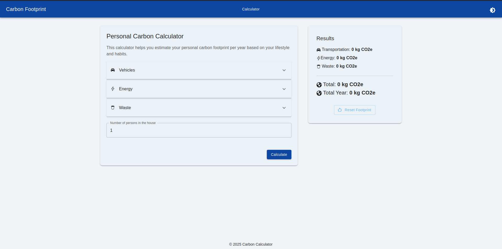

# Carbon Calculator Frontend

This is the frontend for the Carbon Footprint Calculator project, built with React and Material-UI (MUI).



## Features
- Modern UI with Material-UI
- Light and dark theme toggle
- Gamified feedback (badges, progress bar, planet avatar)
- Animated results and eco-level
- Responsive design

## Setup

1. Install dependencies:
   ```bash
   npm install
   ```
2. Start the development server:
   ```bash
   npm run dev
   ```

The app will be available at [http://localhost:5173](http://localhost:5173) by default.

## Usage
- Fill in your transportation, energy, and waste data.
- Click **Calculate** to see your carbon footprint and receive instant feedback.
- Use the theme toggle (top right) to switch between light and dark mode.
- Try to improve your score and earn a better badge!
